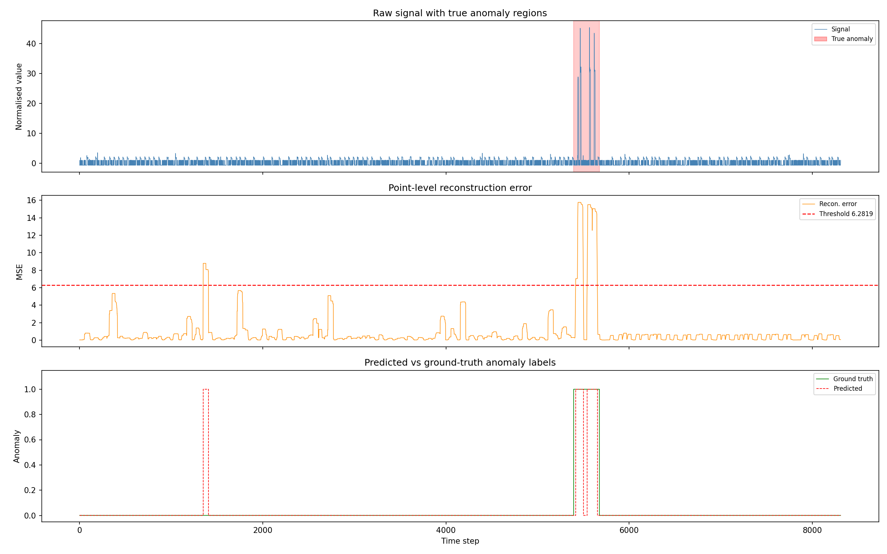
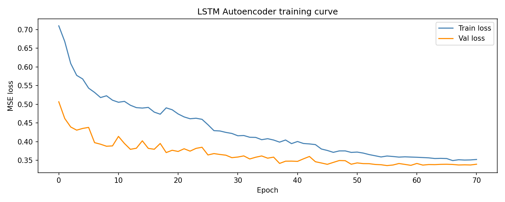

# Anomaly Detection · LSTM Autoencoder · NASA SMAP

[](https://github.com/madhumitha-murthy/timeseries-anomaly-detection/actions/workflows/ci.yml)


Semi-supervised time-series anomaly detection using an **LSTM Autoencoder** trained on NASA SMAP satellite telemetry. The model learns what *normal* looks like and flags time windows it cannot reconstruct accurately. Served via a production-grade **FastAPI REST API**, containerised with Docker, and evaluated with a full metric suite including False Alarm Rate and Detection Delay.

---

## Results

Evaluated on NASA SMAP channel **E-7** (25 features · 8,310 test steps · 3.4% anomaly rate).
Early stopping fired at epoch 71 — no overfitting.

| Model | F1 | Precision | Recall | AUC-ROC | Avg Precision | False Alarm Rate | Detection Delay |
|---|---|---|---|---|---|---|---|
| **LSTM-AE (deployment)** | **0.737** | 0.773 | 0.705 | 0.857 | 0.721 | 0.7% | 22 steps |
| LSTM-AE (oracle ceiling) | 0.757 | 1.000 | 0.609 | 0.857 | 0.721 | 0.0% | 42 steps |
| Isolation Forest | 0.083 | 0.044 | 0.779 | 0.448 | 0.031 | 59.4% | 0 steps |

> **Deployment threshold** = 99th percentile of training reconstruction errors — no test labels needed.
> **Oracle threshold** = best F1 sweep over labelled test set — upper bound only, not a real deployment strategy.
> **False Alarm Rate** = fraction of normal timesteps wrongly flagged. 0.7% means 7 false alerts per 1,000 normal steps.
> **Detection Delay** = median steps from anomaly segment start to first detection.

### Anomaly Detection Plot


### Training Loss Curve


---

## How It Works

```
Input window               Encoder LSTM            Bottleneck
(B, W, F) ─────────────►  (F → hidden_dim)  ────►  h_n[-1]
                                                      │
                                                      │ repeat W times
                                                      ▼
Reconstruction             Decoder LSTM           Decoder input
(B, W, F)  ◄───────────  (hidden → F)       ◄────  (B, W, hidden)
     │
     ▼
MSE vs original  ──►  Deployment threshold  ──►  Anomaly flag (0/1)
```

The model is trained **only on normal data**. At inference, anomalous patterns produce high reconstruction error (MSE). The deployment threshold is derived from the 99th percentile of training errors — calibrated without ever touching the test set.

Each time-step's score is the **maximum** reconstruction error across all windows containing it (*point-adjust*, Hundman et al. 2018).

---

## Project Structure

```
anomaly-detection/
├── src/
│   ├── dataset.py           # Data loading, StandardScaler, sliding windows, train/val split
│   ├── model.py             # LSTMAutoencoder, reconstruction_errors, isolation_forest_errors
│   ├── train.py             # Training pipeline: YAML config, argparse CLI, early stopping,
│   │                        #   deployment threshold, MLflow logging, evaluation, plots
│   ├── api.py               # FastAPI REST API — /predict, /predict/batch, /health, /info
│   └── find_best_channel.py # Sweep all SMAP channels, rank by F1
├── tests/
│   ├── conftest.py          # Shared fixtures (model, API client, temp files)
│   ├── test_dataset.py      # 24 tests — windows, splits, dataloaders
│   ├── test_model.py        # 17 tests — forward shapes, reconstruction errors
│   ├── test_train.py        # 23 tests — training loop, early stopping, threshold search
│   └── test_api.py          # 33 tests — all endpoints, batch inference, health probe
├── notebooks/
│   └── AnomalyDetection_Colab.ipynb  # Interactive walkthrough with ONNX export
├── assets/                  # Plots committed to repo
├── models/                  # Saved checkpoint + threshold.json (gitignored except .gitkeep)
├── outputs/                 # results.json, anomaly plot, loss curve
├── data/                    # SMAP .npy files (not committed)
├── config.yaml              # Default training configuration
├── Dockerfile
├── docker-compose.yml
├── requirements.txt         # Pinned production dependencies
├── requirements-dev.txt     # + pytest, ruff
├── pyproject.toml           # Ruff lint configuration
└── .github/workflows/ci.yml # GitHub Actions: lint + test on every push
```

---

## Quick Start

### 1. Install

```bash
git clone https://github.com/madhumitha-murthy/timeseries-anomaly-detection.git
cd timeseries-anomaly-detection

python -m venv venv && source venv/bin/activate  # Windows: venv\Scripts\activate
pip install -r requirements.txt
```

### 2. Get the Data

```bash
git clone --depth 1 https://github.com/khundman/telemanom.git
cp -r telemanom/data ./data
```

Or download from [Kaggle — NASA SMAP Anomaly Detection Dataset](https://www.kaggle.com/datasets/patrickfleith/nasa-anomaly-detection-dataset-smap-msl) and place the `train/`, `test/`, and `labeled_anomalies.csv` under `data/`.

### 3. Train

```bash
# Default config (config.yaml — channel E-7, window 30, hidden 64)
cd src && python train.py

# Override from CLI
cd src && python train.py --channel P-1 --num_epochs 50 --hidden_dim 128

# Use a custom config file
cd src && python train.py --config ../configs/experiment_2.yaml
```

Outputs:
```
models/lstm_ae_best.pth     ← best checkpoint (saved by val loss)
models/threshold.json       ← deployment threshold (99th pct of train errors)
outputs/results.json        ← full metric suite
outputs/anomaly_results.png ← 3-panel diagnostic plot
outputs/loss_curve.png      ← train/val loss over epochs
```

### 4. Serve the API

```bash
# Local
MODEL_PATH=models/lstm_ae_best.pth \
THRESHOLD_PATH=models/threshold.json \
INPUT_DIM=25 WINDOW_SIZE=30 \
uvicorn src.api:app --host 0.0.0.0 --port 8000

# Docker
docker compose up --build
```

### 5. Run Tests

```bash
pip install -r requirements-dev.txt
pytest --cov=src --cov-report=term-missing
```

---

## API Reference

### `GET /health`
Readiness probe — returns 503 if model not loaded or threshold not configured.
```bash
curl http://localhost:8000/health
```
```json
{"status": "ok", "model_loaded": true, "threshold": 6.28, "device": "cpu"}
```

### `POST /predict`
Score a single time-series window.
```bash
curl -X POST http://localhost:8000/predict \
  -H "Content-Type: application/json" \
  -d '{
    "window": [[0.12, 0.05, -0.3, ...], [...], ...],
    "threshold": 6.28
  }'
```
```json
{
  "anomaly_score": 1.243,
  "is_anomaly": false,
  "threshold_used": 6.28,
  "latency_ms": 11.74
}
```

### `POST /predict/batch`
Score multiple windows in a **single forward pass** — significantly faster than N individual calls.
```bash
curl -X POST http://localhost:8000/predict/batch \
  -H "Content-Type: application/json" \
  -d '[{"window": [[...], ...]}, {"window": [[...], ...]}]'
```

### `GET /info`
Returns model metadata: `input_dim`, `hidden_dim`, `num_layers`, `default_threshold`.

Interactive Swagger docs at **`http://localhost:8000/docs`**.

---

## Configuration

All training hyperparameters live in `config.yaml`. CLI flags override file values.

```yaml
channel:      E-7      # SMAP channel ID
data_dir:     ../data
hidden_dim:   64       # LSTM hidden units
num_layers:   1
dropout:      0.0
window_size:  30       # Sliding window length
batch_size:   32
num_epochs:   200      # Upper bound — early stopping fires before this
lr:           0.001
weight_decay: 0.00001
save_path:    ../models/lstm_ae_best.pth
out_dir:      ../outputs/
```

> `device` is always auto-detected from CUDA availability — never set in the config.

---

## Key Engineering Decisions

| Decision | Rationale |
|---|---|
| **Train/val split (80/20, time-ordered)** | Val set comes from the same anomaly-free training distribution — no leakage. Previously the test set was used for checkpoint selection, inflating reported performance. |
| **Deployment threshold = 99th pct of training errors** | Calibrated without test labels — reflects what a real deployed system can do. Oracle threshold (sweep over test labels) is reported separately as an evaluation ceiling. |
| **Early stopping (patience=15)** | Stops training when val loss stops improving. Fired at epoch 71 on E-7, saving 129 wasted epochs. |
| **Real batch inference (`np.stack` → single forward pass)** | Previously `/predict/batch` called `/predict` N times in a loop — a performance anti-pattern. Now stacks all windows into one tensor (B, W, F) for a single LSTM pass. |
| **Threshold loaded from `threshold.json` at API startup** | Eliminates the hardcoded `THRESHOLD=0.05` that caused every window to be flagged as anomalous (actual trained threshold is ~6.3). |
| **WINDOW_SIZE env var for seq_len validation** | API rejects windows of the wrong length with a 400 before they reach the model, preventing silent shape errors. |
| **Gradient clipping `max_norm=1.0`** | BPTT through many time-steps can cause exploding gradients in LSTMs. Clipping caps the update magnitude without eliminating gradient signal. |
| **IsolationForest contamination = `labels.mean()`** | Previously used `"auto"` (~10%) on a channel with 3.4% anomaly rate, causing the baseline to over-flag and score unfairly. Calibrating to the true rate gives a fair comparison. |
| **Point-adjust max-pooling** | Maps window scores to per-timestep scores by taking the MAX over all containing windows — conservative and standard in the SMAP/MSL literature (Hundman et al. 2018). |
| **MLflow experiment tracking** | Logs hyperparameters, per-epoch train/val loss, and the best checkpoint as an artefact for A/B comparison across runs. |

---

## Metrics Explained

| Metric | Formula | Why It Matters |
|---|---|---|
| **F1** | 2 · P · R / (P + R) | Balanced measure on imbalanced data |
| **Precision** | TP / (TP + FP) | Cost of false alarms |
| **Recall** | TP / (TP + FN) | Cost of missed anomalies |
| **AUC-ROC** | Area under ROC curve | Threshold-independent discriminative power |
| **Avg Precision** | Area under PR curve | Better than AUC-ROC at high class imbalance |
| **False Alarm Rate** | FP / (FP + TN) | Fraction of normal steps wrongly flagged — critical in manufacturing |
| **Detection Delay** | Median steps from anomaly start to first detection | Lead time before failure — lower = earlier warning |

---

## Stack

| Layer | Technology |
|---|---|
| Model | PyTorch LSTM Autoencoder |
| Data | NumPy, Pandas, scikit-learn (StandardScaler) |
| Baseline | scikit-learn IsolationForest |
| API | FastAPI + Pydantic + Uvicorn |
| Experiment tracking | MLflow |
| Containerisation | Docker + Docker Compose |
| CI/CD | GitHub Actions (ruff lint + pytest + coverage) |
| Config | YAML + argparse |

---

## Dataset

**NASA SMAP** (Soil Moisture Active Passive) — released by NASA JPL, curated by Hundman et al. ([Detecting Spacecraft Anomalies Using LSTMs and Nonparametric Dynamic Thresholding](https://arxiv.org/abs/1802.04431), KDD 2018).

- 54 telemetry channels · 562 labelled anomaly sequences
- Pre-split into anomaly-free train and mixed test splits
- Channel E-7: 2,769 train steps · 8,310 test steps · 3.4% anomaly rate
