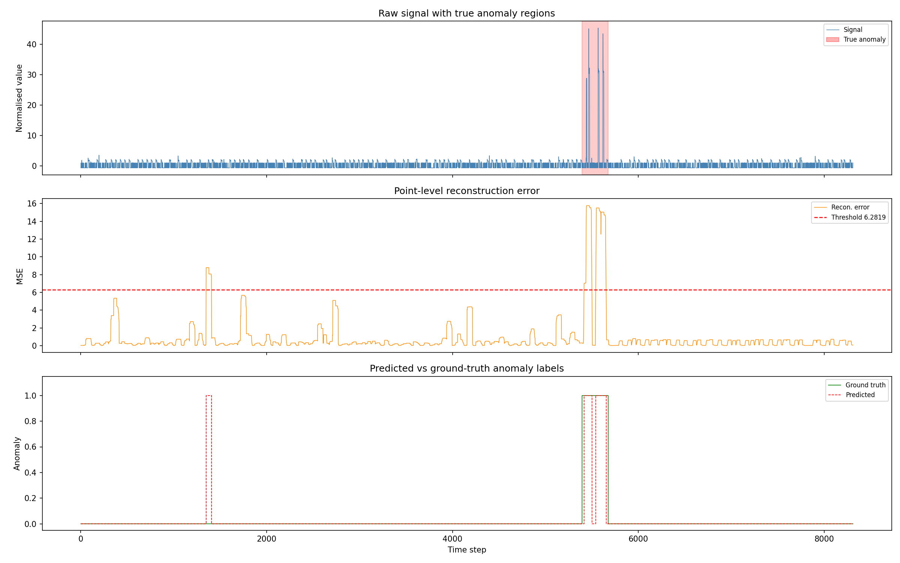
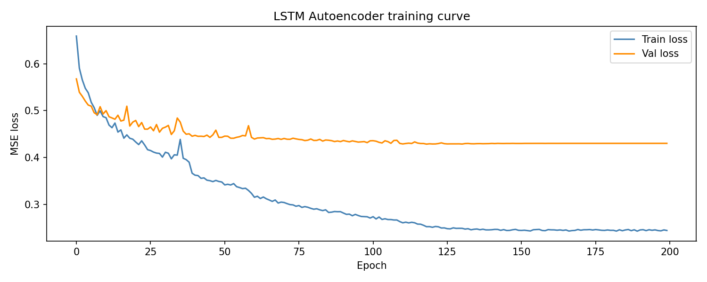

# Anomaly Detection · LSTM Autoencoder · NASA SMAP

[](https://github.com/madhumitha-murthy/timeseries-anomaly-detection/actions/workflows/ci.yml)


Semi-supervised time-series anomaly detection using an **LSTM Autoencoder** trained on NASA SMAP satellite telemetry. The model learns normal behaviour and flags windows it cannot reconstruct accurately. Deployed via a **FastAPI REST API**, containerised with Docker, with LP-based anomaly triage and discrete-event simulation of the inspection workflow.

---

## Results

Evaluated on NASA SMAP channel **E-7** (25 features · 8,310 test steps · 3.4% anomaly rate).

| Model | F1 | Precision | Recall | AUC-ROC | Avg Precision | False Alarm Rate | Detection Delay |
|---|---|---|---|---|---|---|---|
| **LSTM-AE (deployment)** | **0.610** | 0.533 | 0.712 | 0.860 | 0.723 | 2.2% | 21 steps |
| LSTM-AE (oracle ceiling) | 0.765 | 1.000 | 0.619 | 0.860 | 0.723 | 0.0% | 42 steps |
| Isolation Forest | 0.083 | 0.044 | 0.779 | 0.448 | 0.031 | 59.4% | 0 steps |

> Deployment threshold = 99th percentile of training reconstruction errors — no test labels used.
> Oracle threshold = best F1 sweep over labelled test set — upper bound only.

### Anomaly Detection Plot


### Training Loss Curve


---

## How It Works

```
Input window               Encoder LSTM            Bottleneck
(B, W, F) ─────────────►  (F → hidden_dim)  ────►  h_n[-1]
                                                      │
                                                      │ repeat W times
                                                      ▼
Reconstruction             Decoder LSTM           Decoder input
(B, W, F)  ◄───────────  (hidden → F)       ◄────  (B, W, hidden)
     │
     ▼
MSE vs original  ──►  Deployment threshold  ──►  Anomaly flag (0/1)
```

Trained on normal data only. Anomalous patterns produce high reconstruction error (MSE). Each time-step score = max reconstruction error across all containing windows (point-adjust, Hundman et al. 2018).

---

## Project Structure

```
anomaly-detection/
├── src/
│   ├── dataset.py           # Data loading, StandardScaler, sliding windows
│   ├── model.py             # LSTMAutoencoder, reconstruction_errors
│   ├── train.py             # Training pipeline, early stopping, evaluation, plots
│   ├── api.py               # FastAPI — /predict, /predict/batch, /health, /info
│   ├── lp_optimizer.py      # LP triage: constrained fractional knapsack (HiGHS)
│   ├── des_simulator.py     # SimPy discrete-event simulation of inspection queue
│   └── drift_monitor.py     # KS-test data drift detection
├── tests/                   # 68 tests — dataset, model, train, api, LP, DES
├── notebooks/
│   └── AnomalyDetection_Colab.ipynb
├── assets/                  # Plots committed to repo
├── config.yaml              # Default training configuration
├── Dockerfile
├── docker-compose.yml
├── requirements.txt
└── .github/workflows/ci.yml # GitHub Actions: lint + test on every push
```

---

## Quick Start

### 1. Install

```bash
git clone https://github.com/madhumitha-murthy/timeseries-anomaly-detection.git
cd timeseries-anomaly-detection
python -m venv venv && source venv/bin/activate
pip install -r requirements.txt
```

### 2. Get the Data

```bash
git clone --depth 1 https://github.com/khundman/telemanom.git
cp -r telemanom/data ./data
```

Or download from [Kaggle — NASA SMAP Anomaly Detection Dataset](https://www.kaggle.com/datasets/patrickfleith/nasa-anomaly-detection-dataset-smap-msl) and place `train/`, `test/`, and `labeled_anomalies.csv` under `data/`.

### 3. Train

```bash
cd src && python train.py                              # default: channel E-7
cd src && python train.py --channel P-1 --hidden_dim 128
```

Outputs saved to `models/` and `outputs/`.

### 4. Serve the API

```bash
# Local
MODEL_PATH=models/lstm_ae_best.pth \
THRESHOLD_PATH=models/threshold.json \
INPUT_DIM=25 WINDOW_SIZE=30 \
uvicorn src.api:app --host 0.0.0.0 --port 8000

# Docker
docker compose up --build
```

### 5. Run Tests

```bash
pip install -r requirements-dev.txt
pytest --cov=src --cov-report=term-missing
```

---

## API Reference

### `GET /health`
```json
{"status": "ok", "model_loaded": true, "threshold": 5.11, "device": "cpu"}
```

### `POST /predict`
Score a single time-series window.
```bash
curl -X POST http://localhost:8000/predict \
  -H "Content-Type: application/json" \
  -d '{"window": [[0.12, 0.05, -0.3, ...], ...], "threshold": 5.11}'
```
```json
{"anomaly_score": 1.243, "is_anomaly": false, "threshold_used": 5.11, "latency_ms": 11.74}
```

### `POST /predict/batch`
Score multiple windows in a single forward pass.

### `GET /info`
Returns model metadata: `input_dim`, `hidden_dim`, `num_layers`, `default_threshold`.

Swagger docs at **`http://localhost:8000/docs`**.

---

## Anomaly Triage — LP + DES

After detection, flagged segments are triaged under a fixed inspection budget (10% of test steps) using a **constrained fractional knapsack LP** (HiGHS solver):

- **C1** — per-segment budget cap: no single segment may consume more than 25% of the budget
- **C2** — minimum coverage floor: top-2 segments by score must receive ≥ 50% inspection fraction

Three methods compared: LP (constrained), density-greedy (C1 only), naive-greedy (raw score sort).

A **SimPy discrete-event simulation** then models the physical inspection queue — N parallel machines, exponential MTTF/MTTR breakdown model — and compares how LP-fraction ordering vs naive ordering affects wait times.

---

## Stack

| Layer | Technology |
|---|---|
| Model | PyTorch LSTM Autoencoder |
| Data | NumPy, Pandas, scikit-learn |
| Optimisation | SciPy `linprog` (HiGHS) |
| Simulation | SimPy |
| API | FastAPI + Pydantic + Uvicorn |
| Experiment tracking | MLflow |
| Containerisation | Docker + Docker Compose |
| CI/CD | GitHub Actions (ruff + pytest) |

---

## Dataset

**NASA SMAP** — released by NASA JPL, curated by Hundman et al. ([KDD 2018](https://arxiv.org/abs/1802.04431)).
54 telemetry channels · 562 labelled anomaly sequences · pre-split train/test.
